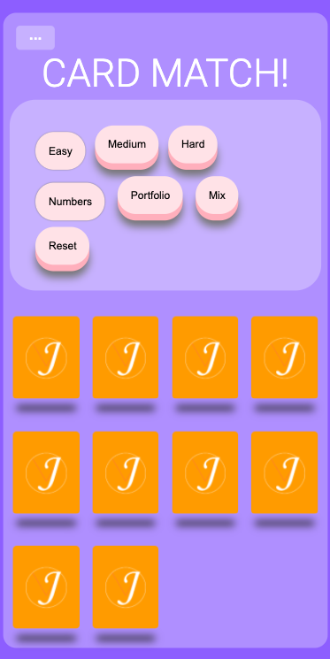

# Matching Card Game

Card Matches and Classes

## Description

Made this application as an exercise in utilizing ES6 classes. I framed my class structure loosely from a MVC framework which encapsulates the interface away from the abstract objects. In this case, the card class handled the content and flipped state of the card, and the gameboard handled injecting the DOM interface with the card representations.

Luckily, the way I set up the code allowed me to quickly switch between card types and the number of cards on the screen, or utilize both. I decided to use screenshots of my other portfolio pieces for the alternate card types.

## Work With Me

If you would like to work with me, feel free to contact me through [my website](https://www.jpmbvistro.com), my [LinkedIn](https://www.linkedin.com/in/juan-justin-vistro/), or email me directly [jpmbvistro@gmail.com](mailto:JPMBVistro@gmail.com)

#Deployed Site
Feel free to take a look at the site yourself here:
https://lnkd.in/dBurpyq

#Screenshots

Screenshot of application in mobile view
